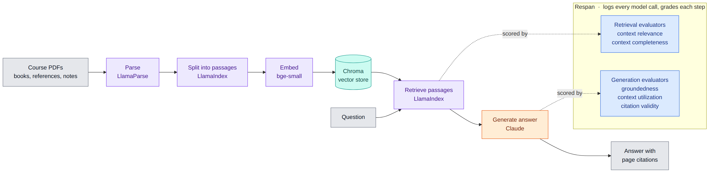

# Ask the Textbook

A study tutor that only knows what your textbook knows.

Upload the PDFs for a course, ask questions, and get answers built from those
books alone: paraphrased in the book's own terminology, cited by page, and
followed by an honest "The course materials don't cover this" when the answer
genuinely isn't in there.



**What this example shows.** Two Respan surfaces that most of the other examples
in this repo don't reach:

- **Gateway-only instrumentation.** There is no tracing SDK here. Generation is
  the plain Anthropic SDK pointed at `RESPAN_GATEWAY_URL`, so a single
  `base_url` gets every call logged, costed and traceable. Retrieval spans are
  posted directly to the request-logs API and correlated by `request_id`.
- **Experiments as the unit of truth.** A RAG pipeline fails in two different
  places, so the app never asks "is this good". It asks "did that change help",
  and answers it by rerunning five deployed graders over a fixed question set.

That makes it a full application rather than a snippet: FastAPI, a build-free
frontend, local Chroma, and a real measurement loop you can rerun after changing
a knob.

## Why

Ask a general chatbot about the Calvin cycle and it will tell you something
true, probably. It will also cheerfully invent a page number, use vocabulary
your lecturer never used, and answer questions your syllabus deliberately left
out. None of that is visible from the outside. The answer looks exactly as
confident either way.

So this app makes refusal a feature. If the retrieved excerpts don't cover the
question, the tutor says so and stops. Every claim carries the source and page
it came from, so you can go read it yourself. The point is a tutor you can
check, not one you have to trust.

The second reason it exists: a RAG pipeline is a great thing to *measure*.
Retrieval and generation fail in different ways, and the interesting question is
never "is it good" but "did that change help". So the whole thing is wired into
Respan, and the answer to that question is an experiment you can rerun.

## The stack, and why

| Piece | What it does | Why this one |
|---|---|---|
| **LlamaIndex** | parse, chunk, embed, retrieve | The boring RAG plumbing, already solved. Swappable parsers and vector stores. |
| **Chroma** | vector store, one collection per subject | Runs on disk, no service to babysit. Per-subject collections keep courses apart. |
| **BAAI/bge-small** | embeddings, locally | No API key, no per-token cost, fast enough. Downloads once on first run. |
| **Claude** via the **Anthropic SDK** | generation | Long context for many excerpts, and it follows a strict grounding prompt well. |
| **Respan Gateway** | logging and routing | One `base_url` change and every call is logged, costed and traceable. |
| **Respan experiments** | grading | Scores live on a platform where runs are comparable, not in a browser tab. |
| **FastAPI** | the server | Endpoints are deliberately sync so blocking work stays off the event loop. |
| **No frontend build** | native ES modules, plain CSS | `uvicorn` is the only command. Nothing to compile, nothing to go stale. |

LlamaParse is optional but recommended for real textbooks. Without a key there
is a built-in PDF reader, fine on simple layouts and weaker on multi-column
pages and tables.

## How it works

```
PDF -> Parse -> Enrich -> Chunk -> Index          once per book
       (LlamaParse)  (caption   (Sentence  (embed -> Chroma)
                      figures)   Splitter)

Question -> Rewrite -> Retrieve -> Generate -> stream answer + citations
            (follow-ups   (per book,   (Claude, tutor prompt
             to standalone) then merged)  + recent turns)
```

A few things that matter more than they look:

**Retrieval is coverage first.** It pulls the best chunks from *every* book in
the subject, then fills the rest by score. A weaker book still gets a seat, so
answers can say "Campbell frames it this way, Raven adds that" instead of
silently picking one.

**Answers stream.** Sources appear the moment retrieval lands, well before the
first word. Markdown renders once the answer completes, so half-arrived tables
and `$math$` never flash on screen.

**Ask or Lecture, per message.** Ask answers the question. Lecture teaches the
concept behind it, and retrieves differently: it pulls the chunks either side of
each hit and presents them in reading order, so the tutor gets a continuous run
of the book instead of three disconnected fragments. Same question, 3 chunks and
a 1400 character answer in Ask, 9 chunks and a 4300 character structured lecture
in Lecture. Attaching an image overrides both and solves the exercise.

**Follow-ups get rewritten.** "Explain that again" is turned into a standalone
query before retrieval, using a cheap model. History tells the tutor what is
being asked; every fact still gets re-grounded in excerpts fetched for the
current question.

**Subjects own books, chats own conversations.** A subject holds the PDFs and
the index. A chat is one thread over it with its own title, teaching style and
model. Many chats share a subject, so a second conversation costs no
re-embedding, and "same books, Socratic vs Exam prep" is a one click comparison.
Chats can also sit unfiled: start typing first, drag it onto a subject later.
Deleting a subject removes its books, never its conversations.

## Setup

Python 3.10+.

```bash
cd fullstack/textbook-tutor
python -m venv .venv && source .venv/bin/activate
pip install -r requirements.txt
cp .env.example .env
```

Every command in this README runs from `fullstack/textbook-tutor`, not the
repository root.

Pick one key for generation:

- **`RESPAN_API_KEY`** (recommended) routes through Respan Gateway. Same
  Anthropic SDK, no `ANTHROPIC_API_KEY` needed, and every call is logged at
  <https://platform.respan.ai/platform/logs>.
- **`ANTHROPIC_API_KEY`** calls Anthropic directly. Used only when
  `RESPAN_API_KEY` is unset.

Optional: **`LLAMA_CLOUD_API_KEY`** for better PDF parsing, free at
<https://cloud.llamaindex.ai>.

```bash
uvicorn backend.app:app --reload
```

Open <http://localhost:8000>. Make a subject, click **Add book**, wait for
ingestion, ask away.

## Evaluation

Grading happens on Respan as an *experiment*, never locally. One implementation
(`backend/experiments.py`), two ways in, so the numbers mean the same thing.

**One answer:** open **Inspect** on any answer and press **Evaluate**. It grades
that answer with the five deployed graders and shows the scores in the panel,
with a lever under anything that fails. Under a minute. The score is stored, so
reopening the chat costs nothing.

**The whole set, for regression:**

```bash
python -m scripts.run_experiment
python -m scripts.run_experiment --name "top-k 8"    # label the run
```

| Step | Graders |
|---|---|
| Retrieve | context relevance, context completeness |
| Generate | groundedness, context utilization, citation validity |

The script answers `evals/questions.json` with the real pipeline, uploads each
prompt and answer to a dataset, and grades it. Generation happens locally
because retrieval runs against local Chroma, which the platform can't reproduce
from a prompt id. Current baseline:

```
RAG · groundedness               1.00   (n=12, min 1.00, max 1.00)
RAG · context utilization        0.99   (n=12, min 0.92, max 1.00)
RAG · citation validity          0.98   (n=12, min 0.80, max 1.00)
RAG · context completeness       0.57   (n=12, min 0.00, max 1.00)
RAG · context relevance          0.35   (n=12, min 0.00, max 0.75)
```

Read that as: generation is solid, retrieval is the weak half. The single
citation failure is real, a malformed page reference the grader caught.

Two design notes worth stealing:

*Why not score live answers on their own?* A number with nothing to compare it
to tells you nothing. Two experiments over the same questions tell you plenty.
Change `TOP_K_PER_BOOK`, run again, read the difference.

*Why the question set is deliberately mixed* (answerable, partly covered, and
out of corpus): a grader that ignores its input shows up as a flat 0.00 or 1.00
across the board instead of hiding inside an average. That has caught real
grader bugs more than once.

Those numbers came from one corpus (a linear algebra textbook, plus the sample
biology PDFs in this directory). Your own books will score differently, so treat
them as a worked example of the loop, not a target to hit.

Graders live in *your* Respan workspace, so their ids can't ship here: they
don't exist until the graders do. Provision them with

```bash
python -m scripts.setup_respan            # dry run, says what it would create
python -m scripts.setup_respan --apply    # create them, write the ids into .env
```

It creates the five graders from `graders.json`, wraps each in a deployed
pipeline, and writes both id families into `.env`. Matched by name and safe to
re-run: anything already there is reused, so it won't grow a second set.

Claude Code users can instead run the **`/setup-respan`** skill, which does the
same thing and also installs the Respan MCP server. It lives in `.claude/skills/`
here, so open `fullstack/textbook-tutor` as your working directory or it won't
be discovered.

## Layout

```
backend/
├── app.py           FastAPI routes, SSE streaming
├── rag.py           retrieval, prompts, generation, spans
├── ingestion.py     parse, caption figures, chunk, index
├── experiments.py   grading on Respan
├── subjects.py      books and the registry
├── chats.py         conversations and their messages
├── store.py         Chroma + embedding settings
└── config.py        every knob, read from .env

frontend/            no build step, served at /static
├── index.html
├── styles/          tokens.css (theme, reset) + app.css (components)
└── js/              dom, state, api, markdown, inspect, chat,
                     subjects, chats, main
```

Imports flow one way (`main -> subjects -> chat -> inspect -> {state, api,
markdown, dom}`), so there are no cycles. Shared state is a single exported
object because ES module bindings are read only for importers.

Theme follows your OS until you press the sun/moon toggle, then your choice
sticks. It resolves before first paint, so switching never flashes white.

## Tests

```bash
pip install -r requirements-dev.txt
pytest
```

162 tests, no API calls, about 5 seconds. They cover the places where a mistake
would be silent rather than loud: history windowing, the coverage first
retrieval merge, citation rendering, the book registry, filing chats in and out
of subjects, the grading contract, and the model/thinking gate.

## Knobs (`.env`)

- `GENERATION_MODEL` sets the default. Each chat also has a model dropdown, so
  two chats on the same books can be compared directly. Adaptive thinking is
  derived per model, so picking a pre 4.6 model just runs without it.
- `TOP_K_PER_BOOK`, `MAX_CONTEXT_CHUNKS`, `CHUNK_SIZE`, `CHUNK_OVERLAP` for
  retrieval and chunking.
- `LECTURE_NEIGHBOUR_WINDOW` (default 1) and `LECTURE_MAX_CHUNKS` (default 18)
  control how much of the book a lecture pulls in around each hit.
- `HISTORY_TURNS` prior turns replayed into each answer (default 6, the last
  three exchanges). `0` restores single turn behaviour.
- `REWRITE_MODEL` turns follow-ups into standalone queries (default
  `claude-haiku-4-5`). Only runs when there is history.
- `CAPTION_MODEL` transcribes uploaded exercises and captions figures (default
  `claude-haiku-4-5`). OCR shaped work, so it doesn't inherit
  `GENERATION_MODEL`; running it on Opus cost about 5x for no gain.
- `THINKING` is `adaptive` (default) or `off`.

On the gateway, confirm the exact model string in the
[Respan model list](https://platform.respan.ai/platform/models). Gateway IDs
sometimes use dated snapshots.

Re-uploading a PDF a subject already has **replaces** it: old chunks dropped,
re-ingested, citation title kept unless you give a new one. Everything lives
under `storage/`, git ignored.

## Maintenance

```bash
python -m scripts.repair_duplicate_books          # dry run
python -m scripts.repair_duplicate_books --apply  # collapse duplicates
```

After changing a grader on the platform, resync the copy `/setup-respan`
provisions from, or the next fresh setup gets the old one:

```bash
python -m scripts.check_graders          # exits 1 on drift
python -m scripts.check_graders --sync
```

One legacy migration ships with the app, kept as a worked example of moving a
storage layout without re-embedding anything. It upgrades installs that predate
subjects, where a single `tutors.json` held everything: each tutor becomes a
subject plus one chat carrying its history, reusing the same id so the vectors
stay valid. A fresh install never needs it.

```bash
python -m scripts.migrate_to_subjects             # dry run
python -m scripts.migrate_to_subjects --apply
```

## What's next

Retrieval is the weak half, and now it has numbers to move against. A similarity
floor is the obvious first experiment: relevance never exceeds 0.75 because a
fixed top-K always drags in a dud chunk.

After that, Practice mode: find real exercises from the book on a topic and
present them verbatim. That one is gated on parsing, since exercises are mostly
notation and the built-in PDF reader mangles it. LlamaParse first, measure, then
decide.
